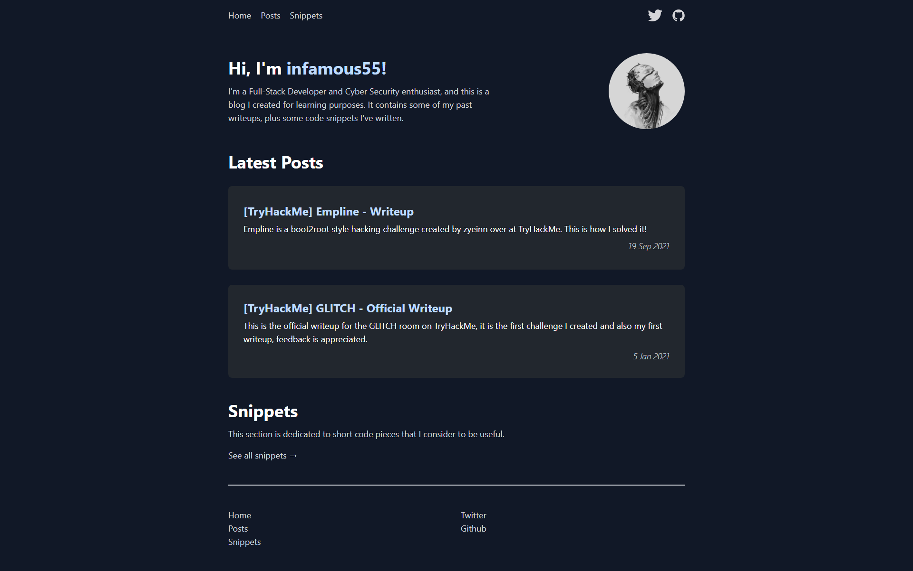

# Next.js Blog



This is a statically generated blog.

## Overview

The website was built using the following technologies:

- [TypeScript](https://www.typescriptlang.org/)
- [Next.js](https://nextjs.org/)
- [Tailwind CSS](https://tailwindcss.com/)

## How it works


Static pages are generated from `.mdx` files, and the content has two types: posts and (code) snippets. The code blocks have syntax highlighting, and there is support for math rendering using Katex. After the build step, an XML sitemap of the site is automatically generated. It also uses Google Analytics which offers a variety of metrics.

## Running locally

```bash
git clone https://github.com/infamous55/nextjs-blog.git
cd nextjs-blog && npm install
npm run build && npm run start
```

Access at [http://localhost:3000](http://localhost:3000).
